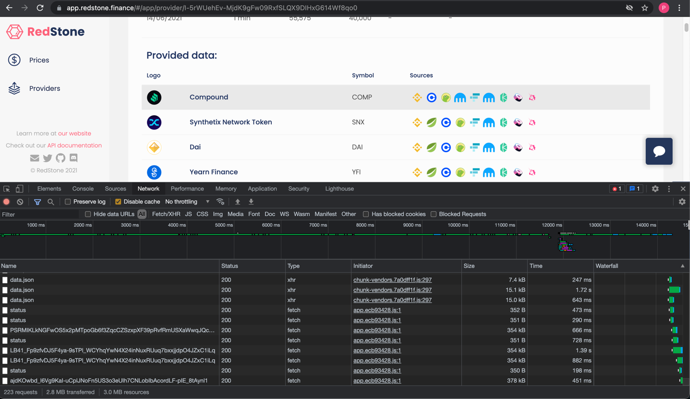
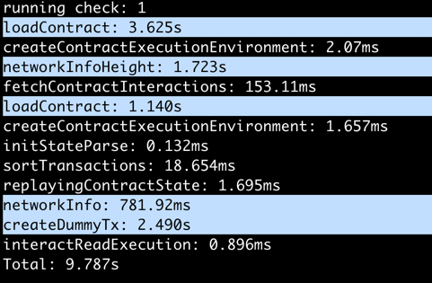
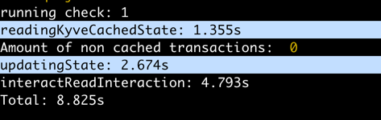
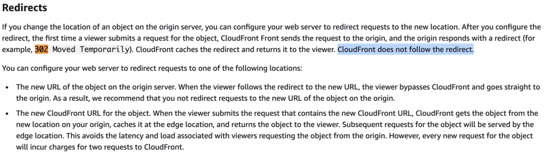
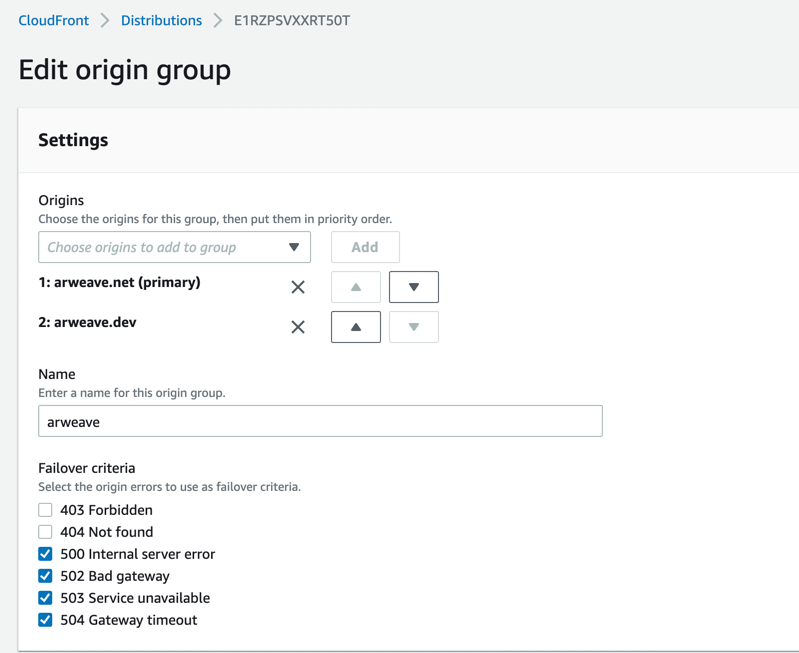
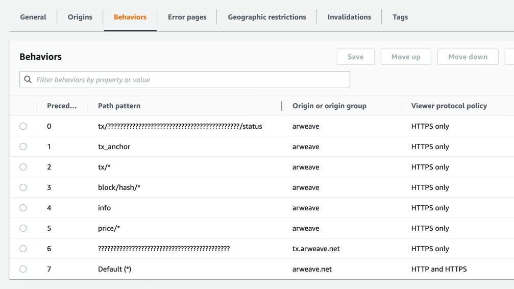
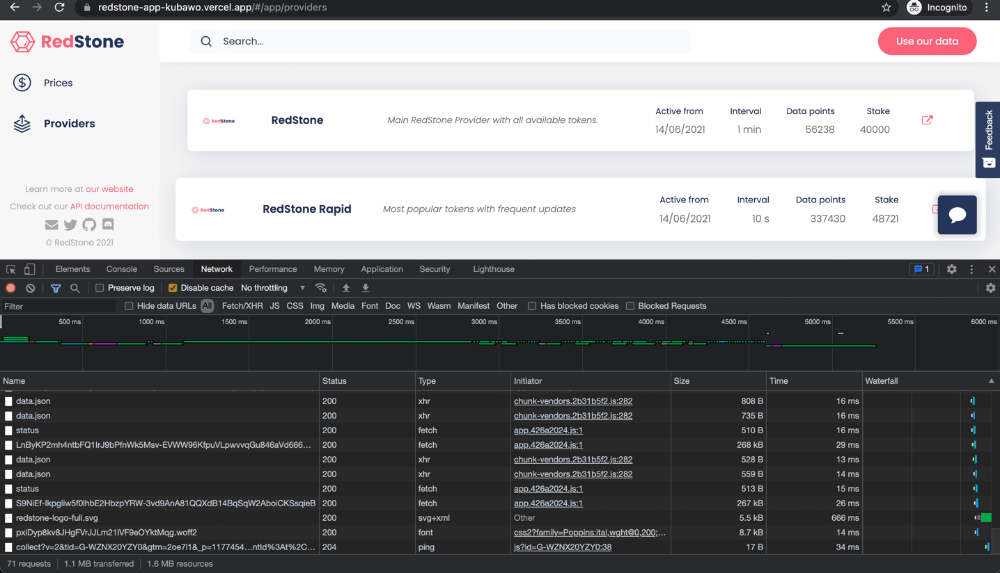
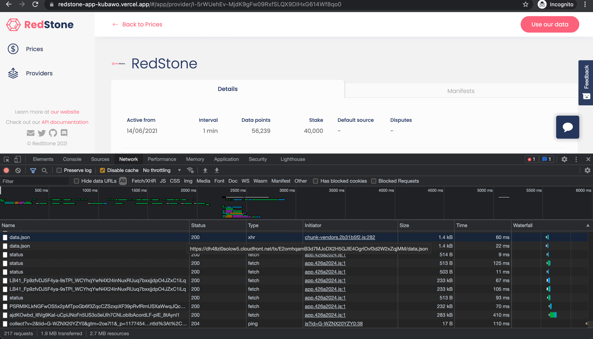

# SmartWeave Contracts Cache - analysis

## The Problem
SmartWeave SDK contract interaction is slow in our case (especially the [interact-read](https://github.com/ArweaveTeam/SmartWeave/blob/master/SDK.md#interactread) SDK function, that we're usually 
using to get the current `view` of the contract's state - in a similar way to how `view` functions are being used in Solidity smart contracts).

This leads to:
* very bad user experience in web applications that are loading its data from SmartWeave contracts. Examples are:  
  - loading Providers list - over 32 seconds
    
  - loading Provider's details - over 14 seconds
  
* contract interaction timeouts in our RedStone nodes ([link](https://github.com/redstone-finance/redstone-node))  
  Each of the node is checking every 120 seconds (at the time of writing) in [providers-registry](https://github.com/redstone-finance/redstone-smartweave-contracts/blob/main/src/providers-registry/providers-registry.contract.ts) SWC whether a new manifest version is available.  
  Total read times (with additional read to [contracts-registry](https://github.com/redstone-finance/redstone-smartweave-contracts/blob/main/src/contracts-registry/contracts-registry.contract.ts)) vary from ~12 to ~23 seconds:
  ```
  running check: 1
  Reading contracts: 21.710s
  running check: 2
  Reading contracts: 19.418s
  running check: 3
  Reading contracts: 15.989s
  running check: 4
  Reading contracts: 14.353s
  running check: 5
  Reading contracts: 11.863s
  running check: 6
  Reading contracts: 17.531s
  running check: 7
  Reading contracts: 15.620s
  running check: 8
  Reading contracts: 23.219s
  running check: 9
  Reading contracts: 17.972s
  running check: 10
  Reading contracts: 21.619s
  ```
  
## The Diagnosis
SmartWeave SDK makes a lot of calls to Arweave HTTP API during smart contract processing
(e.g. loading contract source code, creating transactions, loading initial contract state,
checking network info, checking current block data, etc.).

Some SDK methods (e.g. `interactRead`) don't seem to be optimised towards the lowest possible processing time
(for example unnecessary calls to `loadContract` SDK function or multiple requests to the same Arweave API endpoint
(`/tx_anchor`, `/info`, `/price/4` ...) are being made for single contract interaction).
  
To verify which parts of the `interactRead` are the most time-consuming, additional measurements have been made.:
* The contract - https://viewblock.io/arweave/address/OrO8n453N6bx921wtsEs-0OCImBLCItNU5oSbFKlFuU?tab=state
* The test:
```js
const result = await interactRead(
    arweave,
    jwk,
    "OrO8n453N6bx921wtsEs-0OCImBLCItNU5oSbFKlFuU",
    {
      function: "activeManifest",
      data: {
        providerId: "I-5rWUehEv-MjdK9gFw09RxfSLQX9DIHxG614Wf8qo0",
        eagerManifestLoad: false
      }
    });
```
* The results:  
    
  The most time-consuming operations have been highlighted in blue.  
  Conclusions:
  1. `interactRead` makes one unnecessary call to `loadContract` function and `/info` Arweave HTTP API endpoint
  2. `loadContract` in most cases is the most time-consuming operation (it consists of loading tx with contract, tx with contract's source, tx with contract's initial state)
  3. Creating "dummyTransaction" is also quite time-consuming (it makes calls to `/tx_anchor` and `/price/4` Arweave HTTP API endpoints underneath)
  4. On the contrary - replaying contract's state, fetching and sorting contract's input transactions are relatively fast (by 2 or 3 orders of magnitude faster than e.g. `loadContract`) in our case. 
     The reason for this is probably because our contracts do not have that many "input" transactions (i.e. those created by `interactWrite` SDK function) yet.
     
## Possible solutions
1. [Kyve cache](https://github.com/KYVENetwork/kyve/tree/master/integrations/smartweave) - this solution checks every 10 minutes whether new "input" transactions are available - and stores updated contract's state on Arweave ([link](https://github.com/KYVENetwork/kyve/blob/master/integrations/smartweave/src/index.ts#L67)).
   While reading contract's state, it first [reads state from its Arweave cache](https://github.com/KYVENetwork/kyve/blob/master/common/query/src/smartweave.ts#L22-L62) and then - if there are any non-cached inputs - updates the state with them.  
   Test results:  
     
   As visible above, we're losing quite a lot of time (`1.355s`) on reading cache data from Arweave - in our case it takes much longer to load the cache from Arweave than to replay the state from scratch.  
   This cache also seems to make unnecessary call to `loadContract` , even if cached state is up to date (i.e. [missingTXs.length = 0](https://github.com/KYVENetwork/kyve/blob/master/common/query/src/smartweave.ts#L54)).  
   **Note** - the above issue has been already fixed in this [PR](https://github.com/KYVENetwork/kyve/pull/12).  
   In our case loading times are similar to a non-cached version.  
   To sum up - Kyve cache is a great solution for SWCs with lots of input transactions.
   
2. Custom cache implemented in our [arweave-multihost](https://github.com/redstone-finance/arweave-multihost) - this is a work in progress, we need to decide whether it is still necessary.
3. AWS CloudFront based cache for Arweave HTTP API, optimised for SWC reads from webapps - described below.

### AWS CloudFront based cache

#### Configuration
1. Origins:
    - `arweave.net`, `arweave.dev` and `gateway.amplify.host` origins, organized into groups
   
    - The `c7fqu7cwmsb7dsibz2pqicn2gjwn35amtazqg642ettzftl3dk2a.arweave.net` and `hkz3zh4oo432n4pxnvylnqjm7nbyeitajmeiwtkttijgyuvfc3sq.arweave.net` origins (and `tx.arweave.net` origin group)
have been created specifically for the "transaction data" endpoint (e.g. [https://arweave.net/OrO8n453N6bx921wtsEs-0OCImBLCItNU5oSbFKlFuU](https://arweave.net/OrO8n453N6bx921wtsEs-0OCImBLCItNU5oSbFKlFuU)).
This endpoint always returns `302` status code, with a new location to redirect to (an `arweave.net` subdomain - reasons explained [here](https://discord.com/channels/357957786904166400/358038065974870018/867097075970736168)).  
Unfortunately CloudFront cannot cache such requests as it does not follow the redirect:  
  
That's why the above origins have been configured - to pass "transaction data" requests directly to subdomain locations.
    - Example origin group configuration (with `arweave.net` as primary origin and `arweave.dev` as fallback)  
        
  
2. Behaviours:

   **Note**: AWS CloudFront uses custom (non-regexp) [path pattern](https://docs.aws.amazon.com/AmazonCloudFront/latest/DeveloperGuide/distribution-web-values-specify.html?icmpid=docs_cf_help_panel#DownloadDistValuesPathPattern) matching rules. First (not "best") match wins, so order matters.  
   
   1. `???????????????????????????????????????????` - matches the `transaction endpoint` (txId consists of exactly 43 chars), with `tx.arweave.net` origin group. Uses `TTL_min1day` cache policy.
   2. `tx/???????????????????????????????????????????/status`, `tx_anchor`, `price/*`, `info` all use `ShortTTL_130seconds` cache policy.
      Additionally, to automatically refresh these short-lived caches, simple `arweaveCacheRefresh` lambda function has been defined (called every minute by defined CloudWatch Event).
      ```js 
      exports.handler = async function (_event, _context) {
        try {
            console.info("Refreshing arweave cache...");
            await Promise.all([
                axios.get(`${arCacheUrl}/price/4`),
                axios.get(`${arCacheUrl}/tx_anchor`),
                axios.get(`${arCacheUrl}/info`)
            ]);
            console.info("Refresh complete.")
        } catch (e) {
            console.error(`Error while refreshing arweave cache: ${e}.`);
        }
      }
      ```
   3. the rest of the endpoints are using `TTL_min1day` cache policy.
   
#### Results
- loading Providers list - 5-6 seconds (that's about 5-6x gain)

  
- loading Provider's details - 3 seconds (almost 5x gain)

  
- contract read from node - about 2 seconds - that's more than 6x time gain:
    ```
    running check: 1
    Reading contracts: 3.472s
    running check: 2
    Reading contracts: 1.653s
    running check: 3
    Reading contracts: 1.708s
    running check: 4
    Reading contracts: 1.746s
    running check: 5
    Reading contracts: 1.678s
    running check: 6
    Reading contracts: 1.746s
    running check: 7
    Reading contracts: 1.744s
    running check: 8
    Reading contracts: 1.659s
    running check: 9
    Reading contracts: 1.676s
    running check: 10
    Reading contracts: 1.682s
    ```

